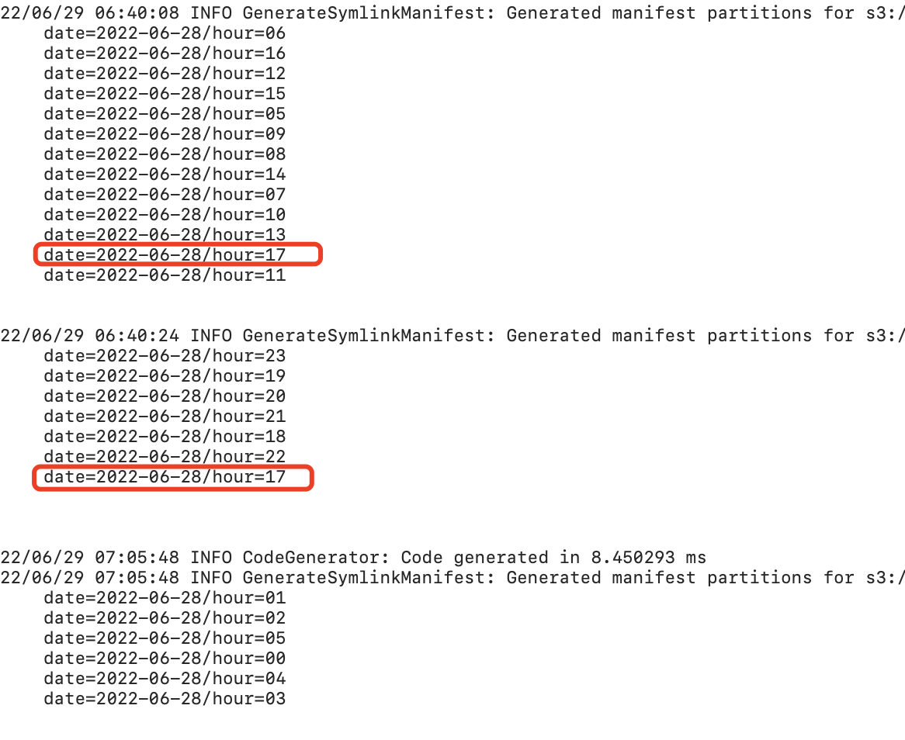

# 从delta + optimize + gen\_manifest的bug聊起(1)

开端是工作中碰到的一个问题，使用的是databricks商业版，Spark 3.1.2 + delta 1.0.0 背景是

1. job1: 数据通过etl/streaming一直写入delta table `db1.tb1`, 数据按照（date,hour）分区
2. job2: 执行`optimize db1.tb1 where date='target_date'； vaccume db1.tb1;`

由于数据需要暴露给Redshift进行查询，因此，我们需要用特定的manifest来告诉 Redshift正确的数据分区信息，详细参见[https://docs.delta.io/latest/redshift-spectrum-integration.html](https://docs.delta.io/latest/redshift-spectrum-integration.html)。基本原理是，对于每个分区数据，有一个manifest文件列了该分区下valid parquet files, 并告诉Redshift我们现在有x分区，x分区执行-> manifest文件->parquet file lists. 这个manifest 文件，其实就是一个Redshift可以识别的分区文件索引。

所以，为了让Redshift能准确读取delta格式的数据，我们还需要格外的任务。

3\. job3: update 每个partition manifest文件，这个我们通过 delta自己的配置，让其在每个commit之后自动增量更新被影响的manifest文件。

```
delta.compatibility.symlinkFormatManifest.enabled=true
```

4\. job4: add/remove partitions to Redshift


这个workflow开始运行得没有什么问题，直到一两个星期后，线上偶尔发现，有些表通过Redshift读取，某些partition指向得数据parquet文件已经丢失。

也就是说，manifest的文件中，parquet文件列表不对。

当时第一反应是，manifest执行的文件是被vaccum掉的小文件，也就是说，optimize之后，delta的自动gen\_manifest并没有正确的把manifest更新，导致，manifest里依旧指向optimize的小文件，而不是合并之后的大文件。

#### 排查

可以发现，首先我们执行了一条optimize命令

`optimize db1.tb1 where date='2022-07-07'`

这条命令执行提交了3个commit，&#x20;

.png>)

而从gen\_manifest日志里，也可以看到这3个commit对应触发的manifest更新



这里值得注意的是，commit1 和 commit2都更新了同一个partition, date=2022-06-28/hour=17.

同时，对应的分区\`date=2022-06-28/hour=17\`的manifest文件变化历史如下图

.png>)

可以看到

a. commit1 -> 一些大文件合并成小文件 -> manifest文件大小从177K缩小成5K

b. commit2 -> manifest文件大小从5K扩大成了156K -> 这次gen\_manifest又引入了一些小文件。

#### 分析

这个问题可以总结一下：

1. optimize db1.tb1 where date='2022-06-28', 这个command的执行，触发了三个并行的transancation.
2. transcation1 ->  基于version1，即txnReadSnapshot=version1, 负责合并了date=2022-06-28/hour=17的大部分小文件 -> 提交后，json log里对这个partition生成了一些AddFile以及对应的Remove File -> current snapshot1 -> 该版本下分区看到的是（合并后大文件 + 少量小文件【transcation2中负责的小文件】。） -> 该版本下的分区parquet files写入manifest,即5K大小
3. transcation2 -> 也基于version1, 即txnReadSnapshot=version1,  负责合并了date=2022-06-28/hour=17的剩余小部分小文件 -> current snapshot2 -> 该版本下分区看到的是(合并后的大文件 + 大量小文件【transcation1中负责的小文件】)-> 该版本下的分区parquet files写入manifest,即156K大小

至此，我们将分析和logs发给databricks supports，得到的回复是

```
This is expected behavior when it has concurrent write.
```

同时，给了一个解决方案是，加入配置

```
delta.optimize.maxThread=1 # 用来限制同步执行的batch数目
delta.optimize.tasksPerComit=1500 #限制一个batch里的并发度
```
